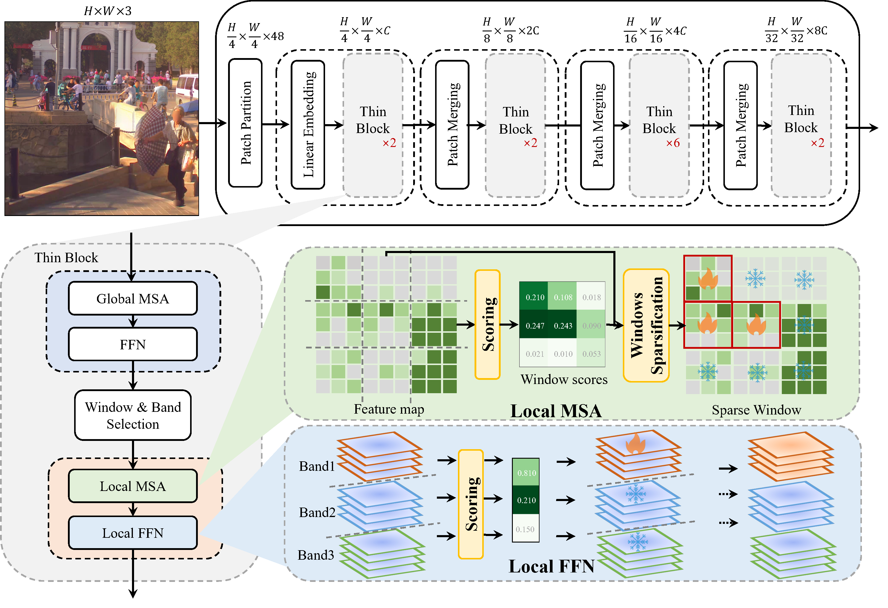

<!-- <div align="center">
  
</div> -->

# ThinFormer

<div align="center">
 


</div>

### ThinFormer: Channel Sparse Transformer for Efficient HRW Object Detection

*Wenxi Li\*, Kunpeng Liu\*, Moran Liu, Shuyang Liu, Chenyang Lyu, Haozhe Lin, Yuchen Guo†*

\* Equal contribution. † Corresponding author.

<!-- **IJCAI 2026** -->

In this paper, we propose ThinFormer, a dynamic and efficient framework tailored for object detection in HRW shots. ThinFormer leverages sparsity in both the spatial domain and the channel domain, the latter enabled by a novel local feed-forward network (local FFN) that exploits the duality between spatial and channel representations. To adapt to varying levels of scene complexity, we introduce a dynamic sparsity ratio estimator, trained in a self-supervised manner, which guides selective activation of channels based on semantic richness.

<p align="center">
  
</p>

---

### Installation

ThinFormer is built on top of [MMDetection](https://github.com/open-mmlab/mmdetection). Please follow the steps below to install.

#### Step 1: Environment Setup

```bash
conda create -n thinformer python=3.9 -y
conda activate thinformer
conda install pytorch==2.5.1 torchvision==0.20.1 torchaudio==2.5.1 pytorch-cuda=12.4 -c pytorch -c nvidia
```

#### Step 2: Install MMDetection

```bash
pip install -U openmim
mim install mmengine
mim install "mmcv>=2.0.0"
cd ..
git clone https://github.com/open-mmlab/mmdetection.git
cd mmdetection
pip install -e .
cd ..
```

#### Step 3: Copy ThinFormer Files to MMDetection

Use the provided installation script to automatically copy ThinFormer files to MMDetection:

```bash
cd Thinformer
chmod +x install.sh
./install.sh ../mmdetection
```

Or copy files manually:

```bash
# Copy backbone
cp Thinformer/models/backbones/Thinformer.py mmdetection/mmdet/models/backbones/

# Copy detectors
cp Thinformer/models/detectors/base_detr_dynamic.py mmdetection/mmdet/models/detectors/
cp Thinformer/models/detectors/deformable_detr_dynamic.py mmdetection/mmdet/models/detectors/
cp Thinformer/models/detectors/dino_dynamic.py mmdetection/mmdet/models/detectors/

# Copy config files
cp Thinformer/configs/Thinformer.py mmdetection/configs/thinformer/
cp Thinformer/configs/_base_/datasets/panda_detection.py mmdetection/configs/_base_/datasets/
```

---

### Dataset

The experiments are conducted on [PANDA](https://gigavision.cn/data/news/?nav=DataSet%20Panda&type=nav). Note that you should modify the `data_root` variable in `panda_detection.py` to be consistent with your PANDA data path.

---

### Training

```bash
cd mmdetection
bash ./tools/dist_train.sh ./configs/Thinformer.py 8
```

---

### Evaluation

```bash
cd Thinformer
python ./inference.py ./configs/Thinformer.py /path/to/your/checkpoint result.pkl --root /path/to/your/PANDA --device cuda:0
```

---

### Supplementary Material

The supplementary material of our paper is available at `supplementary_material.pdf`.